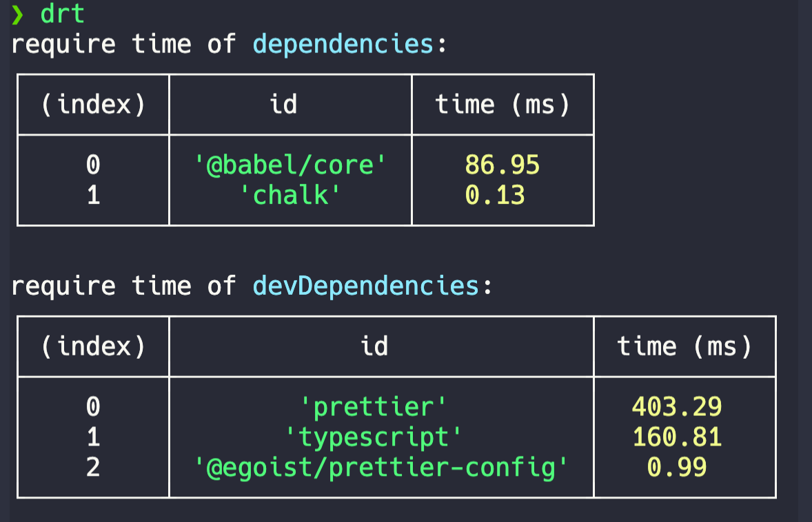

# dep-require-time

[](https://npm.im/dep-require-time) [](https://npm.im/dep-require-time)

> A tool to benchmark the import time of your dependencies.

Run it with:

```bash
npx dep-require-time
```

Or:

```bash
npm i -g dep-require-time
drt
```

Result:


